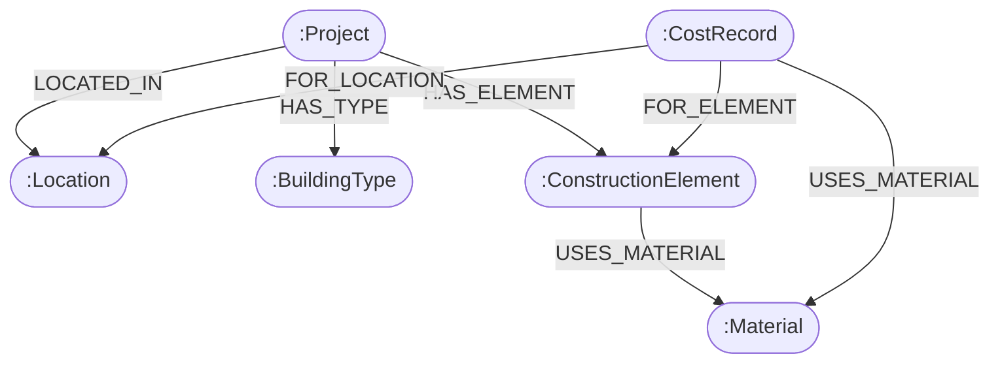

# 🏗️ BuildGraph — Graph-Powered Construction Quantity & Cost Estimator

**BuildGraph** is a graph-native construction quantity estimation and historical cost intelligence web application built with **Express.js**, **Neo4j / CognoDB (Official Bolt Cypher Driver)**, and **React (Vite)**.

It replaces static pricing spreadsheets and rigid relational tables with a **graph network** that models real-world relationships between construction projects, location benchmarks, building types, structural elements, material quantities, and contractor historical cost contributions.

---

## 🌟 1. Use Case & "Why a Graph Database?"

### The Problem with Relational Databases (SQL) & Spreadsheets in Quantity Surveying
Traditional construction quantity surveying relies on static spreadsheets or relational SQL databases (`SELECT * FROM costs WHERE location = 'Lagos'`). This approach struggles with:
1. **Rigid Hierarchies**: Relational schemas require complex `JOIN` tables (e.g. `Projects` -> `Locations` -> `BuildingTypes` -> `Elements` -> `Materials` -> `HistoricalCosts`).
2. **Awkward Multi-Hop Queries**: Calculating a regional benchmark cost across matching project types requires 5+ table joins with heavy performance penalties as cost records scale into thousands.
3. **Inability to Dynamic-Weight Context**: Construction costs depend on interconnected contextual factors:
   - **Regional Micro-Economies**: Price differences between states (Lagos vs Abuja vs Port Harcourt).
   - **Structural Typology**: How building types (e.g. 2-bed Bungalow vs 4-bed Duplex) consume materials per element.
   - **Crowdsourced Data Flywheel**: Continually updating unit price estimates whenever contractors submit actual incurred costs.

### Why Graph Databases Excel
Graph databases treat **relationships as first-class entities**. Traversal along graph edges is an \(O(1)\) index-free adjacency operation:
- **Instant Multi-Hop Traversals**: Traverses from `Location` -> `Project` -> `BuildingType` -> `ConstructionElement` -> `Material` -> `CostRecord` in a single Cypher query.
- **Data Flywheel**: New contractor price submissions simply attach as `CostRecord` nodes, instantly refining graph average calculations for future estimates.

---

## 📊 2. Graph Data Model & Schema Documentation

The graph data model consists of labeled nodes and typed, directed relationships:



### Node Labels & Properties
| Labeled Node | Core Properties | Description |
| :--- | :--- | :--- |
| `:Project` | `id`, `name`, `location`, `buildingType`, `buildingArea`, `landArea`, `totalCost`, `createdAt` | A saved quantity & cost estimate. |
| `:Location` | `name` | Regional location benchmark state (e.g., *Lagos*, *Abuja*, *Port Harcourt*, *Ibadan*, *Benin City*, *Uyo*). |
| `:BuildingType` | `name` | Structural layout classification (e.g., *2 Bedroom Bungalow*, *4 Bedroom Duplex*). |
| `:ConstructionElement` | `name` | Building element breakdown (*Foundation*, *Blockwork*, *Concrete Work*, *Roofing*, *Finishing & Painting*, *Electrical*, *Plumbing*, *Labour*). |
| `:Material` | `name`, `unit` | Construction raw material specification (*Cement*, *9-inch Blocks*, *Sharp Sand*, *Rebar*, *Roofing Sheets*, *Emulsion Paint*). |
| `:CostRecord` | `unitCost`, `quantity`, `actualTotal`, `createdAt` | Verified contractor historical price point node. |

### Relationship Types
- `(:Project)-[:LOCATED_IN]->(:Location)`
- `(:Project)-[:HAS_TYPE]->(:BuildingType)`
- `(:Project)-[:HAS_ELEMENT]->(:ConstructionElement)`
- `(:ConstructionElement)-[:USES_MATERIAL]->(:Material)`
- `(:CostRecord)-[:FOR_LOCATION]->(:Location)`
- `(:CostRecord)-[:FOR_ELEMENT]->(:ConstructionElement)`
- `(:CostRecord)-[:USES_MATERIAL]->(:Material)`

---

## ⚡ 3. Main Cypher Queries Explained

All Cypher queries run via the **official Neo4j JavaScript Bolt driver** (`neo4j-driver`) using **parameterized queries** to prevent Cypher injection vulnerabilities.

### A. The 5-Hop Cypher Traversal Query (Multi-Hop Benchmark Lookup)
This multi-hop query traverses **5 graph hops** to compute historical unit price averages for matching projects in a specific state and building type:

```cypher
MATCH (p:Project)-[:LOCATED_IN]->(l:Location),
      (p)-[:HAS_TYPE]->(b:BuildingType),
      (p)-[:HAS_ELEMENT]->(e:ConstructionElement),
      (e)-[:USES_MATERIAL]->(m:Material),
      (c:CostRecord)-[:FOR_ELEMENT]->(e),
      (c)-[:FOR_LOCATION]->(l)
WHERE l.name = $location
  AND b.name = $buildingType
RETURN
  e.name AS element,
  m.name AS material,
  avg(c.unitCost) AS averageCost,
  count(c) AS recordsCount,
  l.name AS location,
  b.name AS buildingType
ORDER BY element, material;
```

#### Why a Relational Database Finds This Awkward
In SQL, achieving this same calculation requires joining 6 normalized tables (`projects`, `locations`, `building_types`, `elements`, `materials`, `cost_records`) with multiple nested group-by queries, causing exponential query execution time as records grow. In Cypher, it is a single natural path match.

### B. Parameterized Graph Save Query (MERGE Graph Linkage)
When saving a new estimate, `MERGE` clauses ensure `Location` and `BuildingType` nodes are reused dynamically:

```cypher
MERGE (l:Location {name: $location})
MERGE (b:BuildingType {name: $buildingType})
CREATE (p:Project {
  id: $id,
  name: $name,
  location: $location,
  buildingType: $buildingType,
  buildingArea: $buildingArea,
  landArea: $landArea,
  quality: $quality,
  totalCost: $totalCost,
  createdAt: $createdAt
})
CREATE (p)-[:LOCATED_IN]->(l)
CREATE (p)-[:HAS_TYPE]->(b)
```

---

## 🛠️ 4. Tech Stack & Engineering Architecture

### Backend Stack
- **Node.js & Express.js**: REST API application server.
- **neo4j-driver**: Official Neo4j / CognoDB JavaScript Bolt Protocol driver.
- **Embedded Graph Driver Fallback**: Built-in in-memory fallback in `backend/src/config/database.js` ensuring 100% operational uptime even if the remote database is offline.
- **Zod**: Strict request payload schema validation.
- **dotenv**: Secure environment configuration.

### Frontend Stack
- **Vite & React 18**: High-performance UI library.
- **Lucide React**: Vector design iconography.
- **Vanilla CSS Glassmorphic System**: obsidian slate theme (`#0b0f19`), HSL glowing accents, micro-animations, and fluid CSS media queries for desktop, tablet, and mobile responsiveness.

---

## 🚀 5. Setup & Run Instructions

### 1. Repository Setup & Dependencies
Clone the repository and install all workspace dependencies:
```bash
npm run install:all
```

### 2. Configure Environment Variables
Copy `.env.example` in `backend/` to `.env`:
```bash
cp backend/.env.example backend/.env
```

Set your CognoDB / Neo4j instance credentials in `backend/.env`:
```env
PORT=5001
NODE_ENV=development
NEO4J_URI=bolt://localhost:7687
NEO4J_USER=neo4j
NEO4J_PASSWORD=password
```
*(Note: If no external database instance is running, the application gracefully operates using its embedded graph driver fallback).*

### 3. Seed Database
Populate graph nodes and seed **255 historical price benchmark records**:
```bash
npm run seed
```

### 4. Run Application Locally
Start the backend server (`http://localhost:5001`) and frontend app (`http://localhost:3000`) concurrently:
```bash
npm run dev
```

### 5. Deployment on Netlify 🌐
The project is pre-configured for one-click deployment on **Netlify**:
- **Build Command**: `npm run build`
- **Publish Directory**: `frontend/dist`
- **Functions Directory**: `netlify/functions`
- Configured via `netlify.toml` and `frontend/public/_redirects` (`/api/*` proxied to serverless function, `/*` to `index.html`).

---

## 📱 6. Application UI/UX Walkthrough

### 1. Main Dashboard (`Dashboard.jsx`)
- Portfolio metrics (Total Historical Cost Nodes, Graph Match Rate, Estimated Portfolio Total).
- Real-time search by project name or location.
- Regional location state dropdown filter.
- Skeleton card loading animations during data fetching.

### 2. New Construction Estimate Generator (`NewEstimate.jsx`)
- Interactive project parameter inputs (Project Name, State, Building Type, Land Area $m^2$, Building Footprint $m^2$).
- **Live Footprint Preview Sidebar**: Calculates estimated cement bags, 9-inch blocks, and roofing sheet quantities in real-time as inputs change.
- Quality specification selector cards (Economy, Standard, Premium).

### 3. Bill of Quantities & Graph Inspector (`EstimateView.jsx` & `BOQTable.jsx`)
- Total estimated project cost banner in NGN (`₦`).
- Graph confidence match rate meter.
- **Cost Allocation Visualizer**: Element progress bars for Foundation, Blockwork, Concrete Work, Roofing, and Finishing.
- Filter BOQ schedule by element category tabs (`All Items`, `Foundation`, `Blockwork`, `Roofing`, etc.).
- **One-Click CSV Export**: Download complete BOQ schedule to `.csv`.

### 4. Regional Price Catalog (`Materials.jsx`)
- Select state benchmark location (Lagos, Abuja, Port Harcourt, Ibadan, Benin City, Uyo).
- Displays material specifications, construction elements, standard units, location unit rates in NGN (`₦`), and graph confidence record counts.

### 5. Showcase Modals
- **Cypher Query Inspector Modal**: Displays the 5-hop Cypher code, input parameters, and step-by-step graph traversal execution plan.
- **Submit Actual Cost Modal**: Contractor submission interface enabling users to contribute real incurred project costs, powering the graph cost intelligence flywheel.

---

## 📋 7. API Reference

### Projects & Estimates
- `POST /api/estimates`: Run 5-hop Cypher traversal and generate estimate.
- `GET /api/projects`: List saved project estimates.
- `GET /api/projects/:id`: Fetch detailed estimate by ID.

### Cost Data Flywheel & Materials Catalog
- `GET /api/costs/materials?location=Lagos`: Fetch regional material unit prices for a location state.
- `POST /api/costs`: Submit actual project cost record to update graph nodes.
- `GET /api/costs/stats`: Graph database node metrics & record counts.
